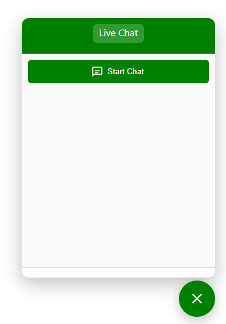
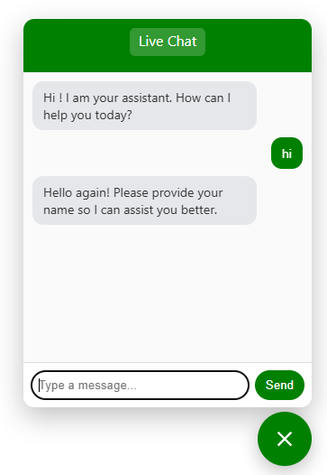

### AI Chatbot Widget

An embeddable, zero‑dependency chat widget you can drop into any website and connect to your n8n, make or zapier (or any HTTP) webhook. It renders a floating chat bubble, optional pre‑chat form, and a simple chat window that posts user messages to your backend and displays replies.

This repository contains:
- `chatbot-widget.js` — the widget script (vanilla JS, no frameworks)
- `testing.html` — a minimal page demonstrating how to embed and configure the widget


### Features
- Lightweight, framework‑free, single JS file
- Floating open/close bubble with customizable colors
- Optional pre‑chat form (Name, Email, Phone) with server submission
- Session tracking across page reloads (simple session ID in `sessionStorage`)
- Typing indicator while awaiting backend response
- Customizable greeting with `{name}` placeholder
- Flexible config: branding, colors, keys, webhook URL, and more


### Quick Start
1) Copy `chatbot-widget.js` to your site (serve from your domain or a CDN).

2) Include it and initialize the widget:

```html
<!-- 1) Include the widget script -->
<script src="/path/to/chatbot-widget.js"></script>

<!-- 2) Initialize it -->
<script>
  ChatbotWidget.init({
    webhookUrl: "https://your-automation.domain/webhook/XXXXXXXX/chat",
    primaryColor: "#2563eb",           // header + user bubbles
    bubbleColor: "#e5e7eb",            // bot bubbles
    botChatColor: "#333333",           // bot text color
    userChatColor: "#ffffff",          // user text color
    chatButtons: "#2563eb",            // start button + launcher buttons

    logoUrl: "https://example.com/logo.png",
    companyName: "Your Assistant",
    initialGreeting: "Hi {name}! How can I help you today?",

    // Form / webhook options
    renderPreChatForm: false,            // show Name/Email/Phone form before chat
    preChatFormUrl: "",                 // POST pre‑chat data here (optional)
    sendFormDataWithMessages: true,      // include saved pre‑chat data in messages

    // Data keys expected by your backend
    chatSessionKey: "sessionId",        // key name for session id in payload
    chatInputKey: "userInput",          // key name for user's message
    replyKey: "output",                 // key name in your backend response to display

    // Positioning
    offsetRight: 24,
    offsetBottom: 24,
  });
  // That's it - click the floating bubble to open the chat.
  // Press "Start Chat" to begin (or fill the pre‑chat form if enabled).
</script>
```

You can also use the provided `testing.html` as a working demo — update its `webhookUrl` to your endpoint and open it in a browser.

### Screenshots of the Widget
<div style="display: flex; justify-content: space-between; margin: 20px 0;">
    
    
</div>

### How It Works
When a user sends a message:
- The widget creates (or reuses) a simple session id in `sessionStorage`.
- It builds a JSON payload and POSTs it to `webhookUrl`.
- It expects your backend to return JSON containing a key matching `replyKey` (default `output`). The value is rendered as the bot’s reply.

Default message payload example (with defaults `chatSessionKey = "sessionId"`, `chatInputKey = "userInput"`):
```json
{
  "action": "sendMessage",
  "sessionId": "abc123...",
  "userInput": "Hello!",
  "preChat": {
    "name": "Jane",
    "email": "jane@example.com",
    "phone": "+1 555 123 4567",
    "sessionId": "abc123..."
  }
}
```

Notes:
- The exact keys for user input and session are configurable via `chatInputKey` and `chatSessionKey`.
- `preChat` is included only if `sendFormDataWithMessages` is true and a pre‑chat form has been successfully submitted (see Pre‑Chat Form below).

Expected backend response (example):
```json
{
  "output": "Thanks for reaching out! How can I assist you today?"
}
```
The widget will display the value from your configured `replyKey` (default `output`).


### Configuration Reference
Below are all supported options with defaults (see descriptions after the block).

```json
{
  "primaryColor": "#2563eb",
  "bubbleColor": "#e5e7eb",
  "botChatColor": "#ffffff",
  "userChatColor": "#ffffff",
  "chatButtons": "blue",
  "logoUrl": "",
  "companyName": "Chat Assistant",
  "initialGreeting": "Hi! How can I help you?",

  "webhookUrl": "",
  "chatSessionKey": "sessionId",
  "chatInputKey": "userInput",
  "replyKey": "output",

  "renderPreChatForm": false,
  "preChatFormUrl": "",
  "sendFormDataWithMessages": true,

  "offsetRight": 24,
  "offsetBottom": 24,
  "zIndex": 999999
}
```

Option descriptions:
- primaryColor: header + user bubble background color (CSS color string)
- bubbleColor: bot bubble background color (CSS color string)
- botChatColor: bot text color (CSS color string)
- userChatColor: user text color (CSS color string)
- chatButtons: color for launcher and start button (CSS color string)
- logoUrl: URL to the logo image in the header (string)
- companyName: title in the header (string)
- initialGreeting: first bot message; supports `{name}` placeholder (string)
- webhookUrl: endpoint to POST messages to (string; required)
- chatSessionKey: key name for session id in payload (string)
- chatInputKey: key name for user message in payload (string)
- replyKey: key to read from backend JSON reply (string)
- renderPreChatForm: show Name/Email/Phone form before starting chat (boolean)
- preChatFormUrl: URL to POST pre‑chat form data (string)
- sendFormDataWithMessages: include saved pre‑chat data with each message (boolean)
- offsetRight / offsetBottom: widget position offsets in pixels (number)
- zIndex: CSS z-index for the widget host (number)


### Pre‑Chat Form
- Enable by setting `renderPreChatForm: true`.
- The form collects `name`, `email`, `phone` and shows a Continue button.
- If `preChatFormUrl` is provided, the widget will POST the form data as JSON to that URL.
  - On a successful (HTTP 2xx) response, the widget proceeds to the chat.
  - On failure (non‑2xx or network error), an inline error message appears and the chat does not start.
- If `sendFormDataWithMessages` is true, saved pre‑chat data will be included in subsequent message payloads as `preChat`.

Important implementation note:
- The widget stores the session id in `sessionStorage` under the key `cbw-session-id`.
- The widget also reserves `cbw-prechat` for locally saved pre‑chat data. Ensure your privacy policy covers this if enabled.


### Theming and UI Behavior
- Colors are applied via CSS custom properties inside the shadow DOM:
  - `--cbw-primary`, `--cbw-bubble`, `--bot-chat-color`, `--user-chat-color`, `--chat-buttons-color`
- The open/close floating bubble toggles the chat window visibility.
- "Start Chat" button displays the pre‑chat form when `renderPreChatForm` is true; otherwise it opens the messages view directly and posts an initial greeting. You can include the contact’s name in the greeting with `{name}` placeholder.
- A simple typing indicator is shown while waiting for the backend response.


### Security, CORS, and Backend Notes
- Your `webhookUrl` must accept JSON POSTs and reply with JSON.
- Configure CORS on your backend to allow requests from your website’s origin.
- Validate and sanitize all incoming data server‑side. Do not trust the client.
- Rate‑limit and authenticate (if needed) on the server. The widget itself is public client‑side code.


### Using with n8n
In n8n, create a Webhook node that:
- Receives a JSON body like the example in “How It Works”.
- Extracts the user message from the key configured via `chatInputKey` (default `userInput`).
- Produces a JSON response object that includes your configured `replyKey` (default `output`).

Minimal n8n response example (Function or Set node):
```js
return [{ json: { output: "Hello! This is n8n responding." } }];
```

### License
This project is provided as‑is, without warranty. Include your chosen license here (MIT, Apache‑2.0, etc.).
